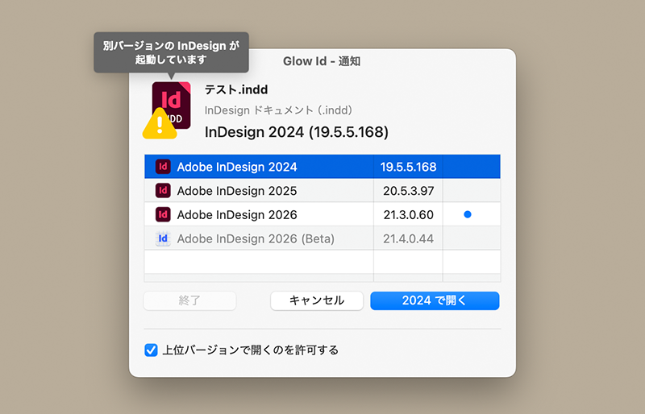

# Glow Id

macOS用デスクトップアプリ

## 用途

Glow Id は、Adobe InDesign ファイル（.indd / .indt / .indb / .indl / .idml）を、そのファイルが作成されたバージョンの InDesign で自動的に開くユーティリティアプリです。

InDesign ファイルは、下位バージョンの InDesign で開けません。さらに、作成バージョンと異なる上位バージョンで開くと、レイアウトが変化してしまうことがあります。トラブルを回避するには、ファイルの作成バージョンを正確に把握し、同じバージョンの InDesign で開く必要があります。

Glow Id は、ファイルの内部に記録されている作成バージョンを読み取り、同じバージョンの InDesign を選んで自動的に開きます。

## 使い方

Glow Id を一度起動すると、.indd / .indt / .indb / .indl / .idml ファイルが Glow Id に自動的に関連付けられます。以降はファイルをダブルクリックするだけで Glow Id が起動し、バージョンを判定して適切な InDesign で開きます。

1. .indd / .indt / .indb / .indl / .idml ファイルをダブルクリックします。
2. Glow Id が起動し、ファイルのバージョンを判定します。
3. バージョンが一致する InDesign が見つかれば自動的に開きます。見つからない場合や、確認が必要な場合は通知ウインドウが表示されます。

詳細は、Glow Id のヘルプメニュー「Glow Id ヘルプ」を選択してください。

## トラブルシューティング
起動時に『Glow Idを「アプリケーション」フォルダへ移動してください』とアラートが出てしまうときの対処方法。

1. Glow Id をゴミ箱に入れて削除
2. zip を再ダウンロード
3. zip を解凍する（ここで Glow Id を起動してはいけない）
4. Glow Id をアプリケーションフォルダへ移動
5. Glow Id を起動

順番通りに行ってください。**順番が重要**です。

## 動作環境

macOS 13.5 Ventura 以降（Universal Binary）

## ライセンス

This project is licensed under the MIT License - see the [LICENSE](LICENSE) file for details.
